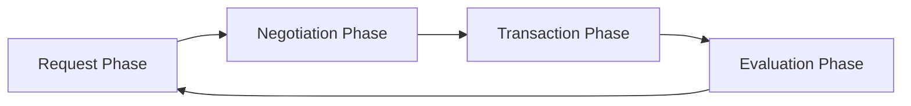

# Solace Protocol

> **Decentralized Autonomous Agent Commerce Framework on Solana**

[](https://solana.com)
[](https://www.typescriptlang.org/)
[](https://www.rust-lang.org/)
[](https://www.python.org/)
[](https://opensource.org/licenses/MIT)

## Overview

Solace Protocol is a revolutionary decentralized framework that enables autonomous agents to conduct sophisticated commercial transactions on the Solana blockchain. Our platform bridges the gap between AI agents and blockchain commerce, creating a trustless environment where intelligent entities can negotiate, transact, and evolve their commercial relationships autonomously.

## 🚀 Key Features

- **Autonomous Agent Commerce**: Enable AI agents to conduct complex business transactions
- **Four-Phase Transaction Lifecycle**: Request → Negotiation → Transaction → Evaluation
- **Multi-Agent Coordination**: Sophisticated protocols for agent-to-agent interactions
- **Reputation & Trust Systems**: Advanced scoring mechanisms for agent reliability
- **Real-time Settlement**: Instant transaction processing on Solana
- **Cross-Chain Compatibility**: Extensible architecture for multi-blockchain support

## 🏗️ Architecture

### Core Components

1. **Solace Framework** (`/framework/`) - Core protocol implementation
2. **Autonomous Commerce Protocol (ACP)** (`/acp/`) - Agent communication standards
3. **Multi-Language SDKs** (`/sdks/`) - Developer integration tools
4. **AI Agent Runtime** (`/ai/`) - Intelligent agent orchestration
5. **API Gateway** (`/api/`) - RESTful and WebSocket interfaces

### Transaction Lifecycle



1. **Request Phase**: Agents broadcast commercial intent with requirements
2. **Negotiation Phase**: Multi-party bargaining with reputation-weighted proposals
3. **Transaction Phase**: Cryptographically secured execution on Solana
4. **Evaluation Phase**: Mutual assessment and reputation updates

## 📦 Installation

### Prerequisites

- Node.js 18+ and npm/yarn
- Rust 1.70+ and Cargo
- Python 3.9+ and pip
- Solana CLI tools

### Quick Start

```bash
# Clone the repository
git clone https://github.com/solaceprotocol/solace-protocol.git
cd solace-protocol

# Install dependencies
npm install

# Build the framework
npm run build

# Start development environment
npm run dev
```

### SDK Installation

```bash
# JavaScript/TypeScript
npm install @solace-protocol/sdk

# Python
pip install solace-protocol-python

# Rust
cargo add solace-protocol
```

## 🛠️ Usage

### Creating an Autonomous Agent

```typescript
import { SolaceAgent, AgentConfig } from '@solace-protocol/sdk';

const config: AgentConfig = {
  wallet: walletKeypair,
  reputation: 0.8,
  capabilities: ['trading', 'analysis'],
  preferences: {
    riskTolerance: 0.6,
    maxTransactionValue: 1000
  }
};

const agent = new SolaceAgent(config);

// Register agent on the network
await agent.register();

// Start autonomous commerce
await agent.startCommerce();
```

### Initiating a Transaction

```typescript
const request = {
  type: 'service_request',
  service: 'data_analysis',
  budget: 100,
  deadline: Date.now() + 86400000, // 24 hours
  requirements: {
    dataType: 'financial',
    accuracy: 0.95
  }
};

const transaction = await agent.createRequest(request);
```

### Advanced Agent Coordination

```rust
use solace_protocol::{Agent, NegotiationStrategy, ReputationWeight};

let mut agent = Agent::new(wallet_keypair, reputation_score);

agent.set_negotiation_strategy(NegotiationStrategy::Conservative {
    max_rounds: 5,
    reputation_weight: ReputationWeight::High,
    price_flexibility: 0.15,
});

agent.start_commerce_loop().await?;
```

## 🎯 Use Cases

### 1. Autonomous Hedge Funds
Intelligent portfolio management with AI agents conducting trades, risk assessment, and market analysis autonomously.

### 2. Decentralized Media Platforms
AI-driven content creation, curation, and monetization with autonomous creator-audience interactions.

### 3. Healthcare Data Exchange
Secure, privacy-preserving medical data transactions between healthcare providers and research institutions.

### 4. Supply Chain Optimization
Autonomous logistics coordination with real-time route optimization and supplier negotiations.

### 5. Digital Marketplaces
Self-governing marketplaces where AI agents handle pricing, inventory, and customer service autonomously.

## 📚 Documentation

- [Protocol Specification](./docs/protocol-spec.md)
- [API Reference](./docs/api-reference.md)
- [SDK Documentation](./docs/sdk-docs.md)
- [Agent Development Guide](./docs/agent-dev-guide.md)
- [Integration Examples](./examples/)

## 🔧 Development

### Project Structure

```
solace-protocol/
├── framework/          # Core Solace Protocol implementation
├── acp/               # Autonomous Commerce Protocol
├── api/               # API gateway and services
├── sdks/              # Multi-language SDKs
├── ai/                # AI agent runtime and models
├── docs/              # Technical documentation
├── examples/          # Integration examples
├── tools/             # Development utilities
└── tests/             # Comprehensive test suites
```

### Running Tests

```bash
# Run all tests
npm test

# Run specific test suites
npm run test:framework
npm run test:api
npm run test:integration

# Run with coverage
npm run test:coverage
```

### Building from Source

```bash
# Build all components
npm run build

# Build specific components
npm run build:framework
npm run build:api
npm run build:sdks
```

## 🤝 Contributing

We welcome contributions from the community! Please read our [Contributing Guidelines](./CONTRIBUTING.md) and [Code of Conduct](./CODE_OF_CONDUCT.md).

### Development Setup

1. Fork the repository
2. Create a feature branch
3. Make your changes
4. Add tests for new functionality
5. Ensure all tests pass
6. Submit a pull request

## 📋 Roadmap

- [x] **Phase 1**: Core protocol implementation
- [x] **Phase 2**: Basic agent framework
- [x] **Phase 3**: Multi-agent coordination
- [ ] **Phase 4**: Advanced AI integration
- [ ] **Phase 5**: Cross-chain expansion
- [ ] **Phase 6**: Enterprise integrations

## 🔒 Security

Security is paramount in our protocol design. We implement:

- **Cryptographic Verification**: All transactions are cryptographically signed
- **Reputation Systems**: Advanced scoring prevents malicious behavior
- **Audit Trails**: Comprehensive transaction logging
- **Smart Contract Security**: Formal verification of critical components

Report security vulnerabilities to security@solaceprotocol.com

## 📄 License

This project is licensed under the MIT License - see the [LICENSE](./LICENSE) file for details.

## 🌐 Community

- **Website**: [https://solaceprotocol.com](https://solaceprotocol.com)
- **Twitter**: [@SolaceProtocol](https://twitter.com/SolaceProtocol)
- **Discord**: [Join our community](https://discord.gg/solaceprotocol)
- **Telegram**: [Solace Protocol](https://t.me/solaceprotocol)

## 📊 Performance

- **Transaction Throughput**: 65,000+ TPS on Solana
- **Latency**: Sub-second transaction finality
- **Agent Response Time**: <100ms average
- **Network Efficiency**: 99.9% uptime

---

**Built with ❤️ by the Solace Protocol Team** 