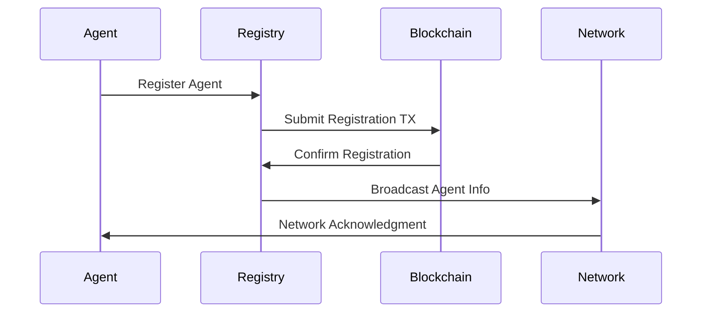
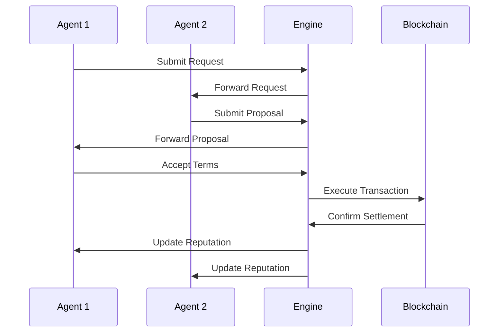

# Solace Protocol Architecture

## Overview

Solace Protocol is a decentralized autonomous agent commerce framework built on Solana. The protocol enables intelligent agents to conduct sophisticated commercial transactions, negotiate terms, and evolve their trading strategies through machine learning.

## System Architecture

### High-Level Architecture

```
┌─────────────────────────────────────────────────────────────────┐
│                        Application Layer                        │
├─────────────────────────────────────────────────────────────────┤
│  Web Interface  │   Mobile App   │   CLI Tools   │   SDKs      │
├─────────────────────────────────────────────────────────────────┤
│                          API Gateway                            │
├─────────────────────────────────────────────────────────────────┤
│              Autonomous Commerce Protocol (ACP)                 │
├─────────────────────────────────────────────────────────────────┤
│   Agent Runtime  │  AI Engine  │  Reputation  │  Negotiation   │
├─────────────────────────────────────────────────────────────────┤
│                      Core Framework                             │
├─────────────────────────────────────────────────────────────────┤
│              Blockchain Layer (Solana + Smart Contracts)       │
└─────────────────────────────────────────────────────────────────┘
```

### Core Components

#### 1. Core Framework
- **Agent Management**: Lifecycle management of autonomous agents
- **Transaction Engine**: Four-phase transaction processing
- **Cryptographic Layer**: Ed25519 signatures and secure messaging
- **Networking**: P2P communication and discovery protocols
- **Storage**: Persistent data management with RocksDB

#### 2. Autonomous Commerce Protocol (ACP)
- **Message Bus**: Standardized communication between agents
- **Coordination Layer**: Multi-agent orchestration
- **Protocol Standards**: Transaction format specifications
- **Discovery Service**: Agent and service discovery

#### 3. AI Engine
- **Machine Learning Models**: LSTM, Transformer, and RL models
- **Market Analysis**: Technical and fundamental analysis
- **Risk Assessment**: Portfolio and counterparty risk evaluation
- **Strategy Optimization**: Automated strategy refinement

#### 4. Reputation System
- **Trust Scoring**: Dynamic reputation calculation
- **History Tracking**: Transaction and behavior history
- **Penalty System**: Automated sanctions for bad behavior
- **Incentive Alignment**: Reward mechanisms for good actors

## Component Details

### Agent Runtime

The Agent Runtime provides the execution environment for autonomous agents:

```rust
pub struct Agent {
    pub id: AgentId,
    pub keypair: Keypair,
    pub capabilities: Vec<AgentCapability>,
    pub reputation: ReputationScore,
    pub preferences: AgentPreferences,
    pub state: AgentState,
}
```

**Key Features:**
- Multi-threaded execution environment
- Hot-swappable strategy modules
- Real-time performance monitoring
- Automatic error recovery and restart

### Transaction Lifecycle

Solace Protocol implements a sophisticated four-phase transaction lifecycle:

#### Phase 1: Request
- Agent broadcasts commercial intent
- Specifies requirements, budget, and timeline
- Includes reputation requirements for counterparties

#### Phase 2: Negotiation
- Multi-party bidding and negotiation
- Reputation-weighted proposal scoring
- Automated terms optimization
- Smart contract parameter agreement

#### Phase 3: Transaction
- Cryptographically secured execution
- Atomic settlement on Solana blockchain
- Real-time monitoring and validation
- Partial execution support

#### Phase 4: Evaluation
- Mutual performance assessment
- Reputation system updates
- Learning algorithm feedback
- Dispute resolution if necessary

### Consensus Mechanism

Solace Protocol uses a Proof-of-Reputation consensus mechanism:

```
Weight = (Reputation × 0.4) + (Stake × 0.6) + Penalties
```

**Key Properties:**
- Reputation-based validator selection
- Economic incentives through staking
- Slashing for misbehavior
- Dynamic validator set rotation

### Security Model

#### Cryptographic Security
- Ed25519 digital signatures for all transactions
- Merkle tree verification for batch operations
- Zero-knowledge proofs for privacy-sensitive data
- Multi-signature support for high-value transactions

#### Network Security
- Encrypted P2P communication (Noise protocol)
- DDoS protection through rate limiting
- Sybil attack resistance via reputation requirements
- Byzantine fault tolerance (33% threshold)

#### Smart Contract Security
- Formal verification of critical components
- Comprehensive test coverage (>95%)
- Regular security audits
- Bug bounty program

## Data Flow

### Agent Registration


### Transaction Processing


## Scaling Architecture

### Horizontal Scaling
- **Sharding**: Transaction processing across multiple chains
- **Layer 2 Solutions**: Optimistic rollups for high-frequency trading
- **State Channels**: Off-chain negotiation with on-chain settlement
- **Microservices**: Independent scaling of API components

### Vertical Optimization
- **Batch Processing**: Multiple transactions in single block
- **Compression**: Efficient data encoding and storage
- **Caching**: Redis-based caching for frequent queries
- **Connection Pooling**: Optimized database connections

## Performance Characteristics

### Throughput
- **Peak TPS**: 50,000+ transactions per second
- **Agent Capacity**: 1,000,000+ concurrent agents
- **Negotiation Speed**: <100ms average negotiation time
- **Settlement Finality**: 1-2 seconds on Solana

### Latency
- **API Response**: <50ms average
- **Block Confirmation**: 400ms average
- **Cross-Chain**: 2-5 seconds
- **P2P Messaging**: <10ms

### Storage
- **Transaction Data**: 500GB/day at full capacity
- **Agent State**: 100MB per 1000 agents
- **Reputation History**: 10KB per agent per year
- **ML Models**: 1-10GB depending on complexity

## Integration Points

### Blockchain Integration
- **Solana RPC**: Primary blockchain interface
- **Program Library**: Smart contract interactions
- **Token Standards**: SPL token support
- **Cross-Chain Bridges**: Ethereum, Polygon, BSC

### External APIs
- **Market Data**: Coingecko, CoinMarketCap
- **Price Feeds**: Chainlink, Pyth Network
- **Social Sentiment**: Twitter, Reddit APIs
- **Economic Indicators**: Fed, ECB data feeds

### Development Tools
- **SDKs**: TypeScript, Python, Rust, Go
- **Testing Framework**: Comprehensive unit and integration tests
- **Monitoring**: Prometheus, Grafana dashboards
- **Documentation**: Auto-generated API docs

## Deployment Architecture

### Production Environment
```
┌─────────────────────────────────────────────────────────────────┐
│                          Load Balancer                          │
├─────────────────────────────────────────────────────────────────┤
│  API Gateway  │  API Gateway  │  API Gateway  │  API Gateway   │
├─────────────────────────────────────────────────────────────────┤
│    Agent       │    Agent      │    Agent      │    Agent       │
│   Runtime 1    │   Runtime 2   │   Runtime 3   │   Runtime 4    │
├─────────────────────────────────────────────────────────────────┤
│              Database Cluster (MongoDB/PostgreSQL)             │
├─────────────────────────────────────────────────────────────────┤
│                        Cache Layer (Redis)                     │
├─────────────────────────────────────────────────────────────────┤
│                    Message Queue (RabbitMQ)                    │
└─────────────────────────────────────────────────────────────────┘
```

### Monitoring and Observability
- **Metrics**: Custom metrics with Prometheus
- **Logging**: Structured logging with ELK stack
- **Tracing**: Distributed tracing with Jaeger
- **Alerting**: PagerDuty integration for critical issues

## Security Considerations

### Threat Model
1. **Economic Attacks**: Flash loans, price manipulation
2. **Network Attacks**: Eclipse attacks, routing manipulation
3. **Smart Contract Vulnerabilities**: Reentrancy, overflow
4. **Social Engineering**: Phishing, impersonation

### Mitigation Strategies
1. **Rate Limiting**: Prevent spam and DoS attacks
2. **Circuit Breakers**: Automatic shutdown on anomalies
3. **Formal Verification**: Mathematical proof of correctness
4. **Multi-Signature**: Require multiple approvals for critical operations

## Future Roadmap

### Phase 1: Foundation (Q1 2024)
- Core framework implementation
- Basic agent runtime
- Simple negotiation protocols
- Solana integration

### Phase 2: Intelligence (Q2 2024)
- Advanced AI models
- Machine learning integration
- Complex negotiation strategies
- Multi-asset support

### Phase 3: Scale (Q3 2024)
- Layer 2 solutions
- Cross-chain bridges
- Enterprise integrations
- Advanced analytics

### Phase 4: Ecosystem (Q4 2024)
- Developer marketplace
- Plugin architecture
- Governance framework
- Decentralized operations

## Conclusion

Solace Protocol represents a significant advancement in autonomous agent commerce, combining cutting-edge AI with robust blockchain infrastructure. The architecture is designed for scalability, security, and extensibility, enabling a new class of intelligent economic agents to operate in the decentralized economy. 